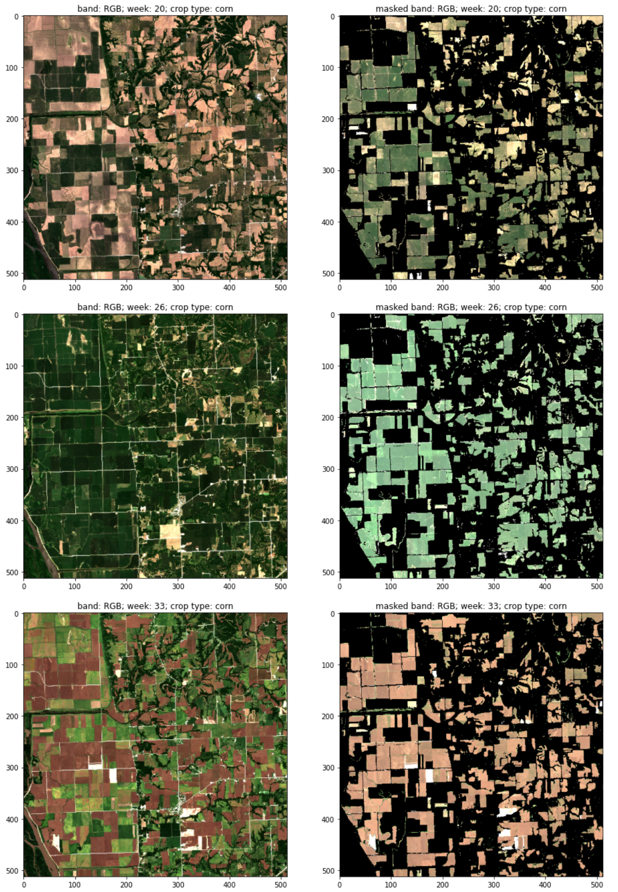
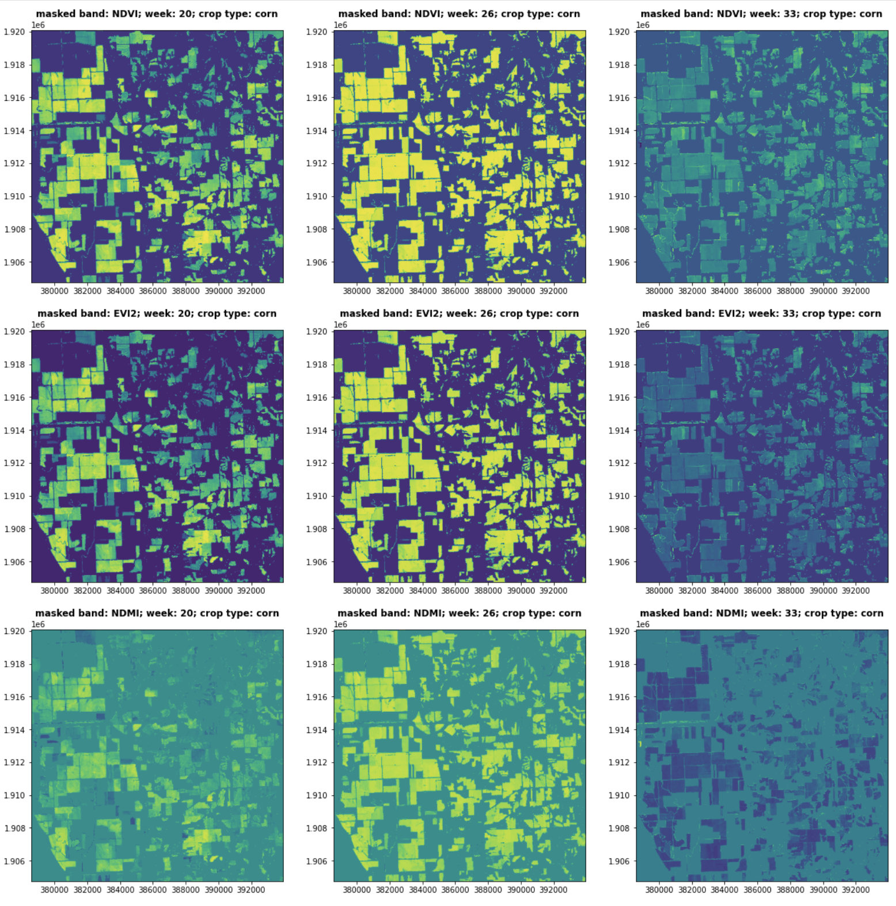

# Crop-Yield-Counterfactuals

* This solution proposes a causal inference framework using Bayesian networks to represent causal dependencies and draw causal conclusions based on satellite imagery and [simulated ground-level observations](https://www.sciencedirect.com/science/article/pii/S2352340921010283#tbl0001). The case study is the causal relationship between Nitrogen-based fertiliser application and corn crop yields. 
* In addition, this solution can be used as a template for building gridded crop models where Nitrogen fertiliser management and environmental policy analysis are conducted.
* The satellite imagery is processed using [Amazon SageMaker geospatial capabilities](https://aws.amazon.com/sagemaker/geospatial/) and custom-built functionalities implemented with [Amazon SageMaker Processing](https://docs.aws.amazon.com/sagemaker/latest/dg/processing-job.html). The causal inference engine is deployed with [Amazon SageMaker Asynchronous Inference](https://docs.aws.amazon.com/sagemaker/latest/dg/async-inference.html).

## Overview

### Input Data

* The simulated dataset contains polygons of the 10 km x 10 km cells that divide the state of Illinois. The data includes the South, Central, and North regions.
* The ground-level observations are complemented with geospatial data, obtained by collecting multi-spectral satellite imagery of consecutive visits corresponding to the following stages of the *corn* phenology cycle:

<table align="center">
  <tr>
    <td align="center" width="750" height="250">
        
    </td>
  </tr>
  <tr>
    <td>Vegetative Stages v5 - R1: $\color{green}{\text{emerged}}$</td>
  </tr>
  <tr>
    <td>Reproductive Stages R1 - R4: $\color{pink}{\text{silking}}$</td>
  </tr>
  <tr>
    <td>Reproductive Stages R5 - R6: $\color{skyblue}{\text{dented}}$, $\color{olive}{\text{mature}}$</td>
  </tr>
</table>

  
* The time range and the region of interest are user-defined. Within the provided [demo notebook](src/demo.ipynb), the Illinois *Central* region is selected for estimating the corn yield as well as studying the corn response to nitrogen using counterfactual and interventional logic.

<table align="center">
  <tr>
    <td align="center">
        
    </td>
  </tr>
  <tr>
    <td>green polygons: counties</td>
  </tr>
  <tr>
    <td>orange grid: 10 km x 10 km cells</td>
  </tr>
  <tr>
    <td>large squares grid: 100 km x 100 km Sentinel-2 UTM tiling grid</td>
  </tr>
</table>

### Data preparation

*  If you want to prepare your own dataset with ground-level observations, please follow the approach described within the [Simulated dataset of corn response to nitrogen over thousands of fields and multiple years in Illinois](https://www.sciencedirect.com/science/article/pii/S2352340921010283) article. The simulated dataset used in this study was generated with the [APSIM](https://www.apsim.info/) simulator.

### Model outputs

* Corn yield estimates (10 km x 10 km cells)
* Counterfactual and interventional analysis of corn response to nitrogen (10 km x 10 km cells)

### Algorithms

* Causal Inference with Bayesian Networks using [causalnex](https://causalnex.readthedocs.io/en/latest/04_user_guide/04_user_guide.html).
* Learning the DAG (Directed Acyclic Graph) structure from data with constraints, using the [NO TEARS Algorithm](https://proceedings.neurips.cc/paper/2018/file/e347c51419ffb23ca3fd5050202f9c3d-Paper.pdf).

### Data Flow

 * [00 Geospatial Processing.ipynb](src/00%20Geospatial%20Processing.ipynb): Performs `Geospatial processing` and cell-level `zonal statistics` of crop-masked multi-spectral vegetation indices.
 * [01 Feature Engineering.ipynb](src/01%20Feature%20Engineering.ipynb): A step-by-step guide on how to ingest custom datasets of `ground-level observations`, how to run variance inflation factor and multicollinearity analysis, and how to use global feature importance with temporal awareness for selecting a set of relevant variables at each stage of the crop phenology cycle.
 * [02 Causal Model.ipynb](src/02%20Causal%20Model.ipynb): A guided study of custom-built `Causal Inference with Bayesian Networks`, which incorporates data-driven and human inputs for learning a DAG (Directed Acyclic Graph) structure with constraints. It includes an Inference Engine for generating yield estimates, as well as inferring the corn response to nitrogen, given interventions anywhere within the graph.

## Solution Details

### Geospatial Processing

* `SageMaker Geospatial ML` is used to:
  * download the multi-spectral satellite imagery
  * filter and remove clouds
  * create geomosaics from multiple satellite visits within a user-defined time range and region of interest
  * compute custom [spectral vegetation indices](https://github.com/awesome-spectral-indices/awesome-spectral-indices#vegetation)
  * resample the geotiffs
* `SageMaker Processing` is used to:
  * download the [crop masks](https://nassgeodata.gmu.edu/CropScape/)
  * warp (incl. re-projection) the spectral indices and the crop masks
  * compute zonal statistics for the polygons of interest (Counties divided by 10 km x 10 km cells)

#### Outputs

  `RGB channels`
  

    
  </figure>

  `Spectral Vegetation Indices (SVIs)`
  

    
  </figure>
  
### Feature engineering

A step-by-step `Exploratory Data Analysis` includes:
  * multicollinearity analysis
  * variation inflation factor analysis
  * global feature importance using [SHAP](https://shap.readthedocs.io/en/latest/index.html) analysis

### Causal Inference

`Background`: Field experts and practitioners are commonly interested in developing frameworks where asking questions is fundamental to developing impactful interventions. Causal inference from observational data is a hot topic, in the absence of experimental data. Structural causal models where causal dependencies are represented using graphical models, particularly Bayesian Networks, are popular approaches. The graphical models incorporate both data-driven and human inputs. Asynchronous inference engines are then used to query the model and support counterfactual and interventional logic.

`Setting`:
  * The crop phenology graph (DAG) is a collection of nodes and edges, where the `nodes` are indicators of crop growth, soil characteristics, atmospheric conditions, and the `edges` between them represent temporal-causal relationships. `Parent nodes` are the field-related parameters (including the day of sowing and area planted) and the `child nodes` are the yield, nitrogen uptake, and nitrogen leaching targets.
  * A crop phenology `DAG (Directed Acyclic Graph)` structure is learned from data, with constraints designed using domain knowledge:
    * The graphical model incorporates crop phenology dynamics extracted from ground-level indicators and spectral vegetation indices. 
    * Continuous features are discretised based on the split thresholds of a decision tree regressor (crop yield is used as a target).
    * Once the graph has been determined, the conditional probability distributions of the variables are learned from the data, using Bayesian parameter estimation.
  * Domain-specific variables are used throughout the solution. For more information, reference the [vocabulary](https://www.sciencedirect.com/science/article/pii/S2352340921010283#tbl0001) for the ground-level variables and the [guide](https://crops.extension.iastate.edu/encyclopedia/corn-growth-stages) for identifying the corn growth stages.
  * Nodes starting with `mean_{spectral vegetation indices}_corn_{isoweek}` are corn growth indicators extracted from the satellite multi-spectral imagery, representing the 10 km x 10 km cell mean value of the following spectral vegetation indices (for each satellite visit):
    * `EVI2` : Two-Band Enhanced Vegetation Index
    * `NDMI` : Normalized Difference Moisture Index
    * `NDVI` : Normalized Difference Vegetation Index
  

  
  

  
  * Corn response to nitrogen is studied by querying the model and making interventions.
    * First, the solution runs inference in order to gain insights about different response curves.
    * Next, the solution uses the inference insights and observation of evidence in order to take actions for the amount of nitrogen added as fertilizer, while observing the effect of these actions on the crop yield, the nitrogen leaching, and the total nitrogen uptake.

## Getting Started

You will need an AWS account to use this solution. Sign up for an account [here](https://aws.amazon.com/).

To run this JumpStart 1P Solution and have the infrastructure deployed to your AWS account, you will need to create an active SageMaker Studio instance (see [Onboard to Amazon SageMaker Studio](https://docs.aws.amazon.com/sagemaker/latest/dg/gs-studio-onboard.html)). When your Studio instance is *Ready*, use the instructions in [SageMaker JumpStart](https://docs.aws.amazon.com/sagemaker/latest/dg/studio-jumpstart.html) to launch the `Crop Yield Counterfactuals` solution.

*Note*: This solution is currently available in *us-west-2* only.

## Contents

* `src/`
  * `00 Geospatial Processing.ipynb`: This notebook chains the geospatial processing steps.
  * `01 Feature Engineering.ipynb`: This notebook performs feature selection and feature engineering.
  * `02 Causal Model.ipynb`: This notebook defines the DAG (Directed Acyclic Graph) structure, computes CPDs (conditional probability distributions), and performs causal inference.
  * `src-geospatial/`: Contains the geospatial processing scripts.
    * `download_crop_mask.py`: Downloads the crop masks from USDA.
    * `geospatial_processing.py`: Uses SageMaker Geospatial ML to download and process satellite images.
    * `feature_extraction.py`: Custom code to compute Zonal Statistics (10 km x 10 km crop-masked cells).
    * `requirements.txt`: Dependencies for the geospatial processing.
    
  * `utils/`: Contains utility scripts
    * `causalnex_helpers.py`: Helper functions used with the causal model.
    * `geospatial_functions.py`: Helper functions used with the geospatial processing.
    * `helper_functions.py`: Generic helper functions used with the manifest files generation.
    * `plot_functions.py`: Plot functions for the DAG (Directed Acyclic Graph) structure.
    * `requirements.in`: Dependencies for notebooks.
    
  * `src-inference/`: Contains the custom inference code.
    * `inference.py`: The inference script.
    * `requirements.txt`: Dependencies required for the inference engine.
  
  * `demo.ipynb`: Demo notebook to quickly compute counterfactuals from the demo endpoint.

## Architecture Overview

Here is architecture for the end-to-end workflow.

  

When finished with this solution, make sure all unwanted AWS resources are deleted. You can use AWS CloudFormation to automatically delete all standard resources that were created by the stacks and the notebooks. Go to the AWS CloudFormation console and delete the parent stack. Choosing to delete the parent stack automatically deletes the nested stacks.

**Caution:** Solution does not support [VPC only mode](https://docs.aws.amazon.com/sagemaker/latest/dg/studio-notebooks-and-internet-access.html). 
Crop masks are obtained from the [NASS geodata services](https://nassgeodata.gmu.edu/CropScape/devhelp/getexamples.html) with user-selected region of interest and phenology calendar.

## Costs

You are responsible for the cost of the AWS services used while running this solution.
* Geospatial processing using Amazon SageMaker Processing and SageMaker Geospatial Services is `~$1`.
* Hosting the model using an Amazon SageMaker Endpoint on an ml.m5.2xlarge instance is `$0.461` per hour.
* Using Amazon SageMaker Studio Notebooks with an ml.m5.large instance is `$0.115` per hour or `$0.7364` per hour with an ml.g4dn.xlarge instance. 

## Useful Resources

* [Amazon SageMaker Getting Started](https://aws.amazon.com/sagemaker/getting-started/)
* [Amazon SageMaker Developer Guide](https://docs.aws.amazon.com/sagemaker/latest/dg/whatis.html)
* [Amazon SageMaker Python SDK Documentation](https://sagemaker.readthedocs.io/en/stable/)
* [Amazon SageMaker Geospatial Capabilities](https://docs.aws.amazon.com/sagemaker/latest/dg/geospatial.html)
* [Amazon SageMaker Asynchronous Inference](https://docs.aws.amazon.com/sagemaker/latest/dg/async-inference.html)

## Authors

* [Paul Barna](https://www.linkedin.com/in/paul-otniel-barna-05a02296) - Senior Data Scientist, ML Prototyping @aws
* [JJ Lim](https://github.com/jinyoung-lim) - Software Development Engineer, AI Platforms @aws

## License

This project is licensed under the Apache-2.0 License.
