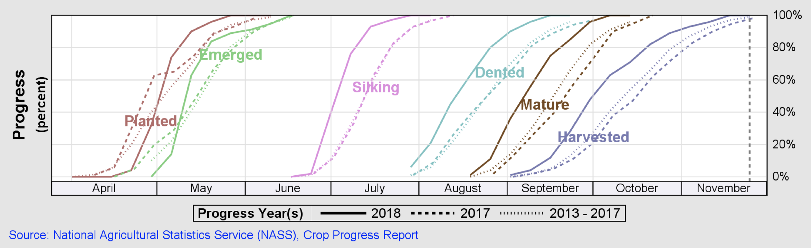
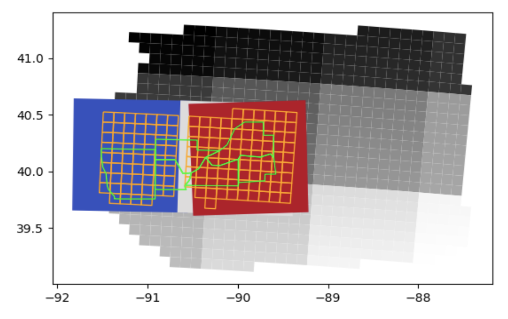

# Crop-Yield-Counterfactuals

* This solution proposes a causal inference framework using Bayesian networks to represent causal dependencies and draw causal conclusions based on observed satellite imagery and experimental data in the form of simulated weather and soil conditions. The [case study](https://www.sciencedirect.com/science/article/pii/S2352340921010283) is the causal relationship between Nitrogen-based fertiliser application and corn crop yields. 
* In addition, this solution can be used as a template for building gridded crop models where Nitrogen fertiliser management and environmental policy analysis are conducted.
* The satellite imagery is processed using [Amazon SageMaker geospatial capabilities](https://aws.amazon.com/sagemaker/geospatial/) and [Amazon SageMaker Processing](https://docs.aws.amazon.com/sagemaker/latest/dg/processing-job.html) operations. The causal inference engine is deployed with [Amazon SageMaker Asynchronous Inference](https://docs.aws.amazon.com/sagemaker/latest/dg/async-inference.html).

## Overview

### Input Data

* The simulated field experiments are mapped to polygons of 10 km x 10 km cells that divide the state of Illinois. The data includes the South, Central, and North regions.
* This solution combines simulated field experiments with observational satellite data. The satellite imagery of consecutive visits corresponds to the following stages of the *corn* phenology cycle:

<table align="center">
  <tr>
    <td align="center" width="750" height="250">
        
    </td>
  </tr>
  <tr>
    <td>Vegetative Stages v5 - R1: $\color{green}{\text{emerged}}$</td>
  </tr>
  <tr>
    <td>Reproductive Stages R1 - R4: $\color{pink}{\text{silking}}$</td>
  </tr>
  <tr>
    <td>Reproductive Stages R5 - R6: $\color{skyblue}{\text{dented}}$, $\color{olive}{\text{mature}}$</td>
  </tr>
</table>

  
* The time range and the region of interest are user-defined. Within the provided [demo notebook](src/demo.ipynb), the Illinois *Central* region is selected for studying the corn response to nitrogen using counterfactual and interventional logic.

<table align="center">
  <tr>
    <td align="center">
        
    </td>
  </tr>
  <tr>
    <td>green polygons: counties</td>
  </tr>
  <tr>
    <td>orange grid: 10 km x 10 km cells</td>
  </tr>
  <tr>
    <td>large squares grid: 100 km x 100 km Sentinel-2 UTM tiling grid</td>
  </tr>
</table>

### Data preparation

* To prepare your own database with simulated field experiments, please follow the approach described within the [Simulated dataset of corn response to nitrogen over thousands of fields and multiple years in Illinois](https://www.sciencedirect.com/science/article/pii/S2352340921010283) article. The simulated dataset used in this study was generated with the [APSIM](https://www.apsim.info/) simulator.

### Model outputs

* Counterfactual analysis of corn response to nitrogen (for each 10 km x 10 km cell)

### Algorithms

* Causal Inference with Bayesian Networks using [causalnex](https://causalnex.readthedocs.io/en/latest/04_user_guide/04_user_guide.html).
* Learning the DAG (Directed Acyclic Graph) structure from data with constraints, using the [NO TEARS Algorithm](https://proceedings.neurips.cc/paper/2018/file/e347c51419ffb23ca3fd5050202f9c3d-Paper.pdf).

### Data Flow

 * [00 Geospatial Processing.ipynb](src/00%20Geospatial%20Processing.ipynb): Performs `Geospatial processing` and cell-level `zonal statistics` of crop-masked multi-spectral vegetation indices.
 * [01 Feature Engineering.ipynb](src/01%20Feature%20Engineering.ipynb): A step-by-step guide on how to ingest custom datasets of `ground-level observations`, how to run variance inflation factor and multicollinearity analysis, and how to use global feature importance with temporal awareness for selecting a set of relevant variables at each stage of the crop phenology cycle.
 * [02 Causal Model.ipynb](src/02%20Causal%20Model.ipynb): A guided study of custom-built `Causal Inference with Bayesian Networks`, which incorporates data-driven and human inputs for learning a DAG (Directed Acyclic Graph) structure with constraints. It includes an Inference Engine for generating yield estimates, as well as inferring the corn response to nitrogen, given interventions anywhere within the graph.

## Solution Details

Please refer to the following AWS blog post: `
* [Generate a counterfactual analysis of corn response to nitrogen with Amazon SageMaker JumpStart solutions](https://aws.amazon.com/blogs/machine-learning/generate-a-counterfactual-analysis-of-corn-response-to-nitrogen-with-amazon-sagemaker-jumpstart-solutions/)

## Getting Started

You will need an AWS account to use this solution. Sign up for an account [here](https://aws.amazon.com/).

To run this JumpStart 1P Solution and have the infrastructure deployed to your AWS account, you will need to create an active SageMaker Studio instance (see [Onboard to Amazon SageMaker Studio](https://docs.aws.amazon.com/sagemaker/latest/dg/gs-studio-onboard.html)). When your Studio instance is *Ready*, use the instructions in [SageMaker JumpStart](https://docs.aws.amazon.com/sagemaker/latest/dg/studio-jumpstart.html) to launch the `Crop Yield Counterfactuals` solution.

*Note*: This solution is currently available in *us-west-2* only.

## Contents

* `src/`
  * `00 Geospatial Processing.ipynb`: This notebook chains the geospatial processing steps.
  * `01 Feature Engineering.ipynb`: This notebook performs feature selection and feature engineering.
  * `02 Causal Model.ipynb`: This notebook defines the DAG (Directed Acyclic Graph) structure, computes CPDs (conditional probability distributions), and performs causal inference.
  * `src-geospatial/`: Contains the geospatial processing scripts.
    * `download_crop_mask.py`: Downloads the crop masks from USDA.
    * `geospatial_processing.py`: Uses SageMaker Geospatial ML to download and process satellite images.
    * `feature_extraction.py`: Custom code to compute Zonal Statistics (10 km x 10 km crop-masked cells).
    * `requirements.txt`: Dependencies for the geospatial processing.
    
  * `utils/`: Contains utility scripts
    * `causalnex_helpers.py`: Helper functions used with the causal model.
    * `geospatial_functions.py`: Helper functions used with the geospatial processing.
    * `helper_functions.py`: Generic helper functions used with the manifest files generation.
    * `plot_functions.py`: Plot functions for the DAG (Directed Acyclic Graph) structure.
    * `requirements.in`: Dependencies for notebooks.
    
  * `src-inference/`: Contains the custom inference code.
    * `inference.py`: The inference script.
    * `requirements.txt`: Dependencies required for the inference engine.
  
  * `demo.ipynb`:  Notebook to quickly compute counterfactuals from the demo endpoint.

## Architecture Overview

Here is architecture for the end-to-end workflow.

  

When finished with this solution, make sure all unwanted AWS resources are deleted. You can use AWS CloudFormation to automatically delete all standard resources that were created by the stacks and the notebooks. Go to the AWS CloudFormation console and delete the parent stack. Choosing to delete the parent stack automatically deletes the nested stacks.

**Caution:** Solution does not support [VPC only mode](https://docs.aws.amazon.com/sagemaker/latest/dg/studio-notebooks-and-internet-access.html). 
Crop masks are obtained from the [NASS geodata services](https://nassgeodata.gmu.edu/CropScape/devhelp/getexamples.html) with user-selected region of interest and phenology calendar.

## Costs

You are responsible for the cost of the AWS services used while running this solution.
* Geospatial processing using Amazon SageMaker Processing and SageMaker Geospatial Services is `~$1`.
* Hosting the model using an Amazon SageMaker Endpoint on an ml.m5.2xlarge instance is `$0.461` per hour.
* Using Amazon SageMaker Studio Notebooks with an ml.m5.large instance is `$0.115` per hour or `$0.7364` per hour with an ml.g4dn.xlarge instance. 

## Useful Resources

* [Amazon SageMaker Getting Started](https://aws.amazon.com/sagemaker/getting-started/)
* [Amazon SageMaker Developer Guide](https://docs.aws.amazon.com/sagemaker/latest/dg/whatis.html)
* [Amazon SageMaker Python SDK Documentation](https://sagemaker.readthedocs.io/en/stable/)
* [Amazon SageMaker Geospatial Capabilities](https://docs.aws.amazon.com/sagemaker/latest/dg/geospatial.html)
* [Amazon SageMaker Asynchronous Inference](https://docs.aws.amazon.com/sagemaker/latest/dg/async-inference.html)

## Authors

* [Paul Barna](https://www.linkedin.com/in/paul-otniel-barna-05a02296) - Senior Data Scientist, ML Prototyping @aws
* [JJ Lim](https://github.com/jinyoung-lim) - Software Development Engineer, AI Platforms @aws

## License

This project is licensed under the Apache-2.0 License.
